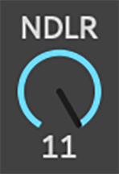

<!--
*** Thanks for checking out the Best-README-Template. If you have a suggestion
*** that would make this better, please fork the repo and create a pull request
*** or simply open an issue with the tag "enhancement".
*** Thanks again! Now go create something AMAZING! :D
***
***
***
*** To avoid retyping too much info. Do a search and replace for the following:
*** ratbag98, repo_name, twitter_handle, email, project_title, project_description
-->

<!-- PROJECT SHIELDS -->
<!--
*** I'm using markdown "reference style" links for readability.
*** Reference links are enclosed in brackets [ ] instead of parentheses ( ).
*** See the bottom of this document for the declaration of the reference variables
*** for contributors-url, forks-url, etc. This is an optional, concise syntax you may use.
*** https://www.markdownguide.org/basic-syntax/#reference-style-links
-->
[![Contributors][contributors-shield]][contributors-url]
[![Forks][forks-shield]][forks-url]
[![Stargazers][stars-shield]][stars-url]
[![Issues][issues-shield]][issues-url]
[![MIT License][license-shield]][license-url]

<!-- PROJECT LOGO -->
 

  

  <h3 align="center">NDLR Control</h3>

  

    Control and automate the NDLR's CC parameters via Max4Live
     
    <a href="https://github.com/ratbag98/ndlr_control/wiki"><strong>Explore the docs »</strong></a>
     
     
    <a href="https://github.com/ratbag98/ndlr_control/">View Demo (maybe one day)</a>
    ·
    <a href="https://github.com/ratbag98/ndlr_control/issues">Report Bug</a>
    ·
    <a href="https://github.com/ratbag98/ndlr_control/issues">Request Feature</a>
  

<!-- TABLE OF CONTENTS -->

  
<h2 style="display: inline-block">Table of Contents</h2>

  <ol>
    <li>
      <a href="#about-the-project">About The Project</a>
      <ul>
        <li><a href="#built-with">Built With</a></li>
      </ul>
    </li>
    <li>
      <a href="#getting-started">Getting Started</a>
      <ul>
        <li><a href="#prerequisites">Prerequisites</a></li>
        <li><a href="#installation">Installation</a></li>
      </ul>
    </li>
    <li><a href="#usage">Usage</a></li>
    <li><a href="#roadmap">Roadmap</a></li>
    <li><a href="#contributing">Contributing</a></li>
    <li><a href="#license">License</a></li>
    <li><a href="#contact">Contact</a></li>
    <li><a href="#acknowledgements">Acknowledgements</a></li>
  </ol>

<!-- ABOUT THE PROJECT -->
## About The Project

[![Product Name Screen Shot][product-screenshot]](https://example.com)

A Max4Live MIDI Instrument to view and control CC parameters on the [NDLR
sequencer](https://conductivelabs.com/).

### Built With

* [Ableton Live 10](https://www.ableton.com/)
* [Max for Live 8](https://www.ableton.com/en/live/max-for-live/)
* [Microsoft VSCode](https://code.visualstudio.com/)

<!-- GETTING STARTED -->
## Getting Started

To get a local copy up and running follow these simple steps.

### Prerequisites

* The NDLR must be running firmware version 1.1.071 or newer. This is a beta firmware. See [the forum](https://conductivelabs.com/forum/showthread.php?tid=235)
* Built using Ableton 10.1.30 and Max4Live 8.1.7. Untested with previous versions

### Installation

Put the NDLR CC Control.amxd file somewhere Ableton can see it.

#TODO list some typical places to put amxd files.

<!-- USAGE EXAMPLES -->
## Usage

MIDI track - set in to "Retrieve" settings (eg Port1, Channel 14). Set out
to NDLR Cntrl settings (eg Port1, Channel 15). Set Monitor to in.

Then add the Device to the MIDI track.

Set the Retrieve information appropriately and click Retrieve.

Click on all 4 control pads to enable playback.

Optionally set the Volca Velocity control.

The available parameters are listed in Appendix A of the [NDLR's User Manual](https://conductivelabs.com/wp-content/uploads/2020/02/The-NDLR-User-Manual-v1.7.pdf).
There are some issues with the documentation currently, take a look at [this issue](https://github.com/ratbag98/ndlr_control/issues/1) for
more details.

_For more examples, please refer to the [Wiki](https://github.com/ratbag98/ndlr_control/wiki)_

<!-- ROADMAP -->
## Roadmap

See the [open issues](https://github.com/ratbag98/ndlr_control/issues) for a list of proposed features (and known issues).

<!-- CONTRIBUTING -->
## Contributing

Contributions are what make the open source community such an amazing place to be learn, inspire, and create. Any contributions you make are **greatly appreciated**.

1. Fork the Project
2. Create your Feature Branch (`git checkout -b feature/AmazingFeature`)
3. Commit your Changes (`git commit -m 'Add some AmazingFeature'`)
4. Push to the Branch (`git push origin feature/AmazingFeature`)
5. Open a Pull Request

<!-- LICENSE -->
## License

Distributed under the MIT License. See `LICENSE` for more information.

<!-- CONTACT -->
## Contact

Robert Rainthorpe - use [open issues](https://github.com/ratbag98/ndlr_control/issues) or the [NDLR community forum thread](https://conductivelabs.com/forum/showthread.php?tid=1251) to communicate.

Project Link: [https://github.com/ratbag98/ndlr_control](https://github.com/ratbag98/ndlr_control)

<!-- ACKNOWLEDGEMENTS -->
## Acknowledgements

* [Conductive Labs](https://conductivelabs.com/), creators of the NDLR
* [Jesse Johannesen](https://conductivelabs.com/forum/member.php?action=profile&uid=970), forum moderator and helpful soul
* [othneildrew](https://github.com/othneildrew/Best-README-Template), for the README template

<!-- MARKDOWN LINKS & IMAGES -->
<!-- https://www.markdownguide.org/basic-syntax/#reference-style-links -->
[contributors-shield]: https://img.shields.io/github/contributors/ratbag98/ndlr_control.svg?style=for-the-badge
[contributors-url]: https://github.com/ratbag98/ndlr_control/graphs/contributors
[forks-shield]: https://img.shields.io/github/forks/ratbag98/ndlr_control.svg?style=for-the-badge
[forks-url]: https://github.com/ratbag98/ndlr_control/network/members
[stars-shield]: https://img.shields.io/github/stars/ratbag98/ndlr_control.svg?style=for-the-badge
[stars-url]: https://github.com/ratbag98/ndlr_control/stargazers
[issues-shield]: https://img.shields.io/github/issues/ratbag98/ndlr_control.svg?style=for-the-badge
[issues-url]: https://github.com/ratbag98/ndlr_control/issues
[license-shield]: https://img.shields.io/github/license/ratbag98/ndlr_control.svg?style=for-the-badge
[license-url]: https://github.com/ratbag98/ndlr_control/blob/master/LICENSE.txt
[product-screenshot]:  https://raw.githubusercontent.com/ratbag98/ndlr_control/master/UI/prerelease/20201218_main.png
